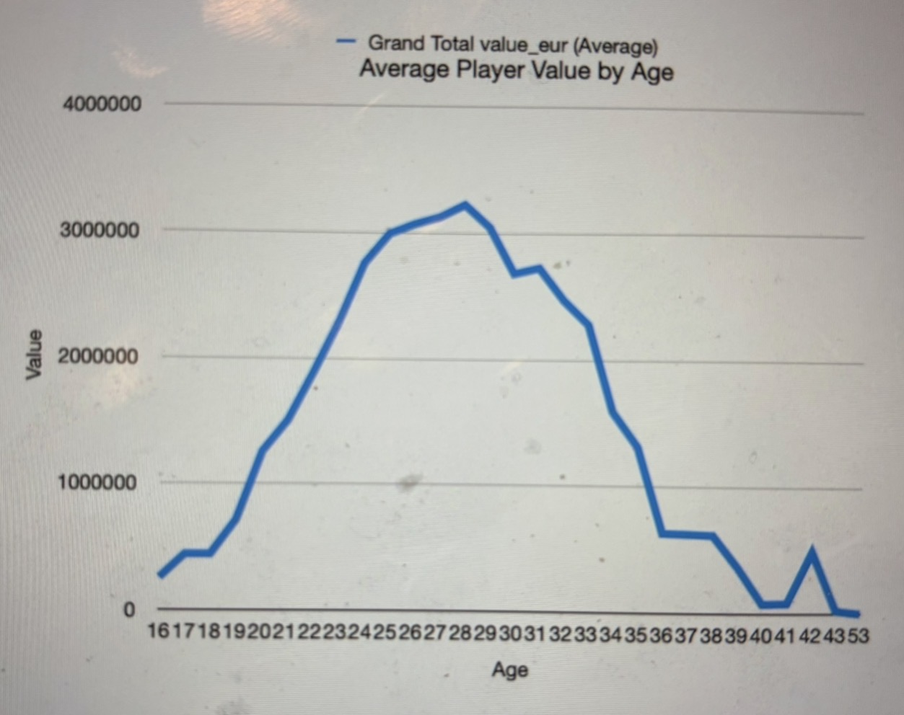
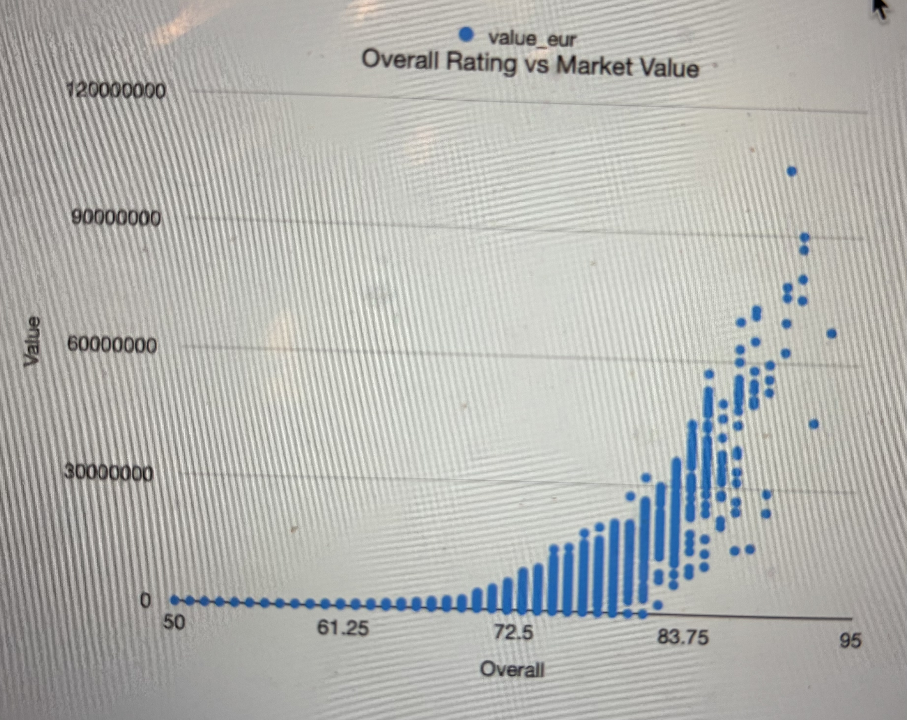

# FIFA-player-value-analysis
# Objective
This project analyzes a dataset of approximately 19,000 football players to identify the key factors that influence player market value. FIFA player attributes are used as a proxy for real-world performance. 
# Dataset
~19,000 players
Key variables include:
Age
Overall rating
Market value (EUR)
Skill attributes (pace, shooting, passing, dribbling, defending, physical)
Player position
# Methodology
Selected relevant variables from a larger dataset

Explored relationships between player value and:

Age

Overall rating

Individual skill attributes

Used sorting and grouping (e.g., average value by age) to identify patterns

Compared top-valued players to identify common characteristics
# Key Findings
1. Age and Value

Player market value peaks around age 28 and declines significantly in the early 30s.
2. Overall Rating

While there is a strong positive relationship between overall rating and player value, the wide variation—especially at higher ratings—suggests that other factors such as age and potential significantly influence valuation.
3. Youth Premium:
Younger players often have higher valuations than older players with similar or even higher ratings, suggesting that future potential plays a major role in pricing.
4. Attribute Specialization:
High-value players typically exhibit elite performance in at least one key attribute (such as pace, shooting, or dribbling).
5. Position Differences:
The importance of specific attributes varies by position. For example, midfielders and defenders tend to rely less on pace compared to attacking players.
# Conclusion
Player market value is influenced by a combination of age, overall ability, and standout skill attributes. While performance is important, younger players and those with specialized strengths tend to command higher valuations.
# Notes
FIFA player attributes are used as a proxy for real-world performance and may not perfectly reflect actual market dynamics.
